Voici la retranscription exacte de votre fichier HTML au format Markdown :

# TP — DevSecOps / Monitoring

---

## Vue d'ensemble


---

## Partie 1 — Application Node.js (15 min)

### 1.1 Initialiser le projet

```bash
mkdir nodeapp-devsecops && cd nodeapp-devsecops
npm init -y
npm install express prom-client

```

### 1.2 Créer `app.js`

```javascript
const express    = require('express');
const promClient = require('prom-client');

const app = express();
const register = promClient.register;

// Métriques par défaut (CPU, mémoire, event loop)
promClient.collectDefaultMetrics({ register });

// Counter — requêtes HTTP totales
const httpTotal = new promClient.Counter({
  name: 'http_requests_total',
  help: 'Total requêtes HTTP',
  labelNames: ['method', 'route', 'status'],
});

// Histogram — durée des requêtes
const httpDuration = new promClient.Histogram({
  name: 'http_request_duration_seconds',
  help: 'Durée des requêtes HTTP',
  buckets: [0.01, 0.05, 0.1, 0.3, 0.5, 1],
});

// Middleware d'instrumentation
app.use((req, res, next) => {
  const end = httpDuration.startTimer();
  res.on('finish', () => {
    httpTotal.inc({ method: req.method, route: req.path, status: res.statusCode });
    end();
  });
  next();
});

// Routes
app.get('/',        (req, res) => res.json({ message: 'Hello DevSecOps!' }));
app.get('/health',  (req, res) => res.json({ status: 'ok' }));
app.get('/metrics', async (req, res) => {
  res.set('Content-Type', register.contentType);
  res.end(await register.metrics());
});

app.listen(3000, () => console.log('App démarrée sur le port 3000'));

```

### 1.3 Tester en local

```bash
node app.js &
curl http://localhost:3000/
curl http://localhost:3000/health
curl http://localhost:3000/metrics   # doit afficher les métriques Prometheus

```

---

## Partie 2 — Conteneurisation (10 min)

### 2.1 Créer le `Dockerfile`

```dockerfile
FROM node:20-alpine

WORKDIR /app

COPY package*.json ./
RUN npm ci --only=production

COPY app.js .

RUN addgroup -S appgroup && adduser -S appuser -G appgroup
USER appuser

EXPOSE 3000
HEALTHCHECK --interval=30s --timeout=5s \
  CMD wget -qO- http://localhost:3000/health || exit 1

CMD ["node", "app.js"]

```

### 2.2 Créer `.dockerignore`

```text
node_modules
.env
*.log

```

### 2.3 Build et test local

```bash
docker build -t nodeapp:local .
docker run -d -p 3000:3000 --name test nodeapp:local
curl http://localhost:3000/health
docker stop test && docker rm test

```

---

## Partie 3 — Pipeline DevSecOps sur GitHub (20 min)

### 3.1 Architecture du pipeline

```mermaid
flowchart TD
    Push([git push]) --> Trigger

    subgraph Pipeline ["GitHub Actions — CI/CD"]
        Trigger --> Build

        Build["Build node:20-alpine npm ci"] --> Hadolint
        Hadolint["Hadolint Lint Dockerfile"] --> Trivy
        Trivy["Trivy Scan vuln image"] --> CodeQLk
        CodeQL["CodeQL Analyse statique JS"] --> Push_GHCR

        Push_GHCR["Push ghcr.io/user/nodeapp"]
    end

    Push_GHCR --> GHCR[("GitHub Container Registry")]

    style Build fill:#1E3A5F,color:#fff
    style Hadolint fill:#E6522C,color:#fff
    style Trivy fill:#E6522C,color:#fff
    style CodeQL fill:#E6522C,color:#fff
    style Push_GHCR fill:#0D9488,color:#fff

```



### 3.2 Initialiser le dépôt GitHub

```bash
git init
echo "node_modules/" > .gitignore
echo ".env"         >> .gitignore
git add .
git commit -m "feat: initial Node.js app"

```

Créer le dépôt sur [github.com](http://github.com), puis :

```bash
git remote add origin [https://github.com/VOTRE_USERNAME/nodeapp-devsecops.git](https://github.com/VOTRE_USERNAME/nodeapp-devsecops.git)
git push -u origin main

```

### 3.3 Créer le workflow

Créer le fichier `.github/workflows/devsecops.yml` :

```yaml
name: DevSecOps Pipeline

on:
  push:
    branches: [main]
  pull_request:
    branches: [main]

env:
  IMAGE_NAME: ghcr.io/${{ github.repository_owner }}/nodeapp

jobs:
  # ── Job 1 : Build & Tests
  build:
    name: Build & Test
    runs-on: ubuntu-latest
    steps:
      - uses: actions/checkout@v4

      - uses: actions/setup-node@v4
        with:
          node-version: '20'
          cache: 'npm'

      - name: Installer les dépendances
        run: npm ci

      - name: Vérifier que l'app démarre
        run: |
          node app.js &
          sleep 2
          curl -sf http://localhost:3000/health || exit 1
          kill %1

  # ── Job 2 : Lint Dockerfile
  hadolint:
    name: Lint Dockerfile
    runs-on: ubuntu-latest
    needs: build
    steps:
      - uses: actions/checkout@v4
      - uses: hadolint/hadolint-action@v3.1.0
        with:
          dockerfile: Dockerfile

  # ── Job 3 : Build image + Scan Trivy
  trivy:
    name: Scan Trivy
    runs-on: ubuntu-latest
    needs: build
    steps:
      - uses: actions/checkout@v4

      - name: Build image Docker
        run: docker build -t nodeapp:scan .

      - name: Scan Trivy (CRITICAL + HIGH)
        uses: aquasecurity/trivy-action@master
        with:
          image-ref: nodeapp:scan
          format: table
          severity: CRITICAL,HIGH
          exit-code: '1'

  # ── Job 4 : Analyse CodeQL
  codeql:
    name: Analyse CodeQL
    runs-on: ubuntu-latest
    needs: build
    permissions:
      security-events: write
      actions: read
      contents: read
    steps:
      - uses: actions/checkout@v4

      - name: Initialiser CodeQL
        uses: github/codeql-action/init@v3
        with:
          languages: javascript

      - name: Analyse CodeQL
        uses: github/codeql-action/analyze@v3

  # ── Job 5 : Push sur GHCR (seulement si tout est vert)
  publish:
    name: Publier sur GHCR
    runs-on: ubuntu-latest
    needs: [hadolint, trivy, codeql]
    if: github.ref == 'refs/heads/main'
    permissions:
      contents: read
      packages: write
    steps:
      - uses: actions/checkout@v4

      - name: Login GHCR
        uses: docker/login-action@v3
        with:
          registry: ghcr.io
          username: ${{ github.actor }}
          password: ${{ secrets.GITHUB_TOKEN }}

      - name: Métadonnées image
        id: meta
        uses: docker/metadata-action@v5
        with:
          images: ${{ env.IMAGE_NAME }}
          tags: |
            type=sha,prefix=sha-
            type=raw,value=latest

      - name: Build & Push image
        uses: docker/build-push-action@v5
        with:
          context: .
          push: true
          tags: ${{ steps.meta.outputs.tags }}
          labels: ${{ steps.meta.outputs.labels }}

```

### 3.4 Committer et pousser

```bash
git add .github/
git commit -m "ci: add DevSecOps pipeline"
git push

```

Vérifier l'exécution dans **GitHub → Actions** (les 5 jobs doivent passer en vert).

> **⚠️ Si Trivy échoue** : une vulnérabilité CRITICAL a été détectée dans l'image. Mettre à jour la version de base dans le Dockerfile (`node:20-alpine` → vérifier la version la plus récente) et repousser.

---

## Partie 4 — Stack Monitoring (15 min)

### 4.1 Architecture de monitoring


### 4.2 Configuration Prometheus

Créer `prometheus/prometheus.yml` :

```yaml
global:
  scrape_interval: 15s

scrape_configs:
  - job_name: 'nodeapp'
    static_configs:
      - targets: ['app:3000']

  - job_name: 'node-exporter'
    static_configs:
      - targets: ['node-exporter:9100']

```

### 4.3 `docker-compose.yml`

```yaml
networks:
  monitoring:           # réseau partagé entre tous les conteneurs

volumes:
  prometheus_data:      # persistance des métriques Prometheus
  grafana_data:         # persistance des dashboards Grafana

services:

  # ── 1. Votre application Node.js
  app:
    build: .
    ports:
      - "3000:3000"
    networks: [monitoring]
    restart: unless-stopped

  # ── 2. Prometheus — collecte et stocke les métriques
  prometheus:
    image: prom/prometheus:v2.48.0
    volumes:
      - ./prometheus/prometheus.yml:/etc/prometheus/prometheus.yml:ro
      - prometheus_data:/prometheus
    command:
      - '--config.file=/etc/prometheus/prometheus.yml'
      - '--web.enable-lifecycle'
    ports:
      - "9090:9090"
    networks: [monitoring]
    restart: unless-stopped

  # ── 3. Grafana — visualisation des métriques
  grafana:
    image: grafana/grafana:10.2.0
    environment:
      GF_SECURITY_ADMIN_USER: admin
      GF_SECURITY_ADMIN_PASSWORD: admin123
    volumes:
      - grafana_data:/var/lib/grafana
    ports:
      - "3001:3000"       # Grafana écoute en interne sur 3000, on expose sur 3001
    networks: [monitoring]
    depends_on: [prometheus]
    restart: unless-stopped

  # ── 4. Node Exporter — métriques système (CPU, RAM, disque...)
  node-exporter:
    image: prom/node-exporter:v1.7.0
    ports:
      - "9100:9100"
    networks: [monitoring]
    restart: unless-stopped

```

### 4.4 Lancer la stack

```bash
docker compose up -d --build

```

Vérifier que les 4 conteneurs sont bien démarrés :

```bash
docker compose ps

```

Résultat attendu — tous les conteneurs doivent afficher `running` :

```text
NAME             STATUS          PORTS
nodeapp-app      running         0.0.0.0:3000->3000/tcp
nodeapp-prom     running         0.0.0.0:9090->9090/tcp
nodeapp-grafana  running         0.0.0.0:3001->3000/tcp
nodeapp-nodeexp  running         0.0.0.0:9100->9100/tcp

```

### 4.5 Vérifier que Prometheus scrape bien l'app

**Ouvrir** [http://localhost:9090/targets](https://www.google.com/search?q=http://localhost:9090/targets) dans le navigateur.

Vous devez voir deux lignes avec le statut **`UP`** en vert :

```text
nodeapp        http://app:3000/metrics           UP
node-exporter  http://node-exporter:9100/metrics  UP

```

> **Si un target est `DOWN**` : vérifier que le service est bien dans le réseau `monitoring` dans le `docker-compose.yml` et relancer avec `docker compose restart`.

### 4.6 Explorer les métriques dans Prometheus

**Ouvrir** [http://localhost:9090](https://www.google.com/search?q=http://localhost:9090)

Dans le champ de recherche en haut, taper :

```text
http_requests_total

```

Cliquer sur **Execute** → vous voyez les valeurs brutes collectées depuis votre app.

Essayer ensuite une requête calculée :

```text
rate(http_requests_total[1m])

```

Cliquer sur l'onglet **Graph** pour voir l'évolution dans le temps.

> Si les valeurs sont à 0 ou vides, envoyer quelques requêtes à l'app d'abord :
> ```bash
> for i in $(seq 1 20); do curl -s http://localhost:3000/ > /dev/null; sleep 0.3; done
> 
> ```
> 
> 

---

## Partie 5 — Dashboard Grafana

### 5.1 Se connecter à Grafana

**Ouvrir** [http://localhost:3001](https://www.google.com/search?q=http://localhost:3001)

Saisir les identifiants :

* **Username :** `admin`
* **Password :** `admin123`

Grafana demande de changer le mot de passe → cliquer **Skip** pour l'instant.

### 5.2 Ajouter Prometheus comme source de données

Grafana ne sait pas encore où se trouve Prometheus. Il faut lui indiquer.

**Étape par étape :**

1. Dans le menu de gauche, cliquer sur l'icône ⚙️ **Administration** (ou **Connections** selon la version)
2. Cliquer sur **Data sources**
3. Cliquer sur le bouton bleu **Add data source**
4. Dans la liste, cliquer sur **Prometheus**
5. Dans le champ **Connection → Prometheus server URL**, saisir :
```text
http://prometheus:9090

```


> On utilise le nom du service Docker `prometheus`, pas `localhost`, car Grafana tourne dans un conteneur et communique via le réseau Docker interne.


6. Laisser tous les autres champs par défaut
7. Faire défiler vers le bas et cliquer sur **Save & test**
8. Un bandeau vert **✅ Successfully queried the Prometheus API** doit apparaître

### 5.3 Créer un nouveau dashboard

1. Dans le menu de gauche, cliquer sur l'icône 🏠 **Home** → **Dashboards**
2. Cliquer sur le bouton bleu **New** (en haut à droite) → **New dashboard**
3. Cliquer sur **+ Add visualization**
4. Une fenêtre s'ouvre pour choisir la datasource → cliquer sur **Prometheus**

L'éditeur de panel s'ouvre. Il est composé de :

* **Zone du haut** : aperçu du graphe (vide pour l'instant)
* **Zone du bas** : éditeur de requête PromQL
* **Panneau droit** : options de visualisation (type, titre, unités...)

### 5.4 Panel 1 — Requêtes par seconde

**Dans l'éditeur de requête (zone du bas) :**

1. Dans le champ **Metrics**, effacer ce qui est écrit et saisir :
```text
rate(http_requests_total[1m])

```


2. Cliquer sur **Run queries** (ou attendre 1-2 secondes)
3. Le graphe en haut doit afficher une courbe

**Configurer le panel (panneau de droite) :**

4. Dans le champ **Title** (en haut du panneau droit), écrire : `Requêtes par seconde`
5. Le type de visualisation **Time series** est déjà sélectionné par défaut → le garder

**Sauvegarder le panel :**

6. Cliquer sur **Apply** (bouton en haut à droite)

### 5.5 Panel 2 — Taux d'erreur HTTP

De retour sur le dashboard, cliquer sur **Add** → **Visualization**.

1. Choisir la datasource **Prometheus**
2. Dans le champ **Metrics**, saisir :
```text
sum(rate(http_requests_total{status=~"5[0-9][0-9]"}[1m])) / sum(rate(http_requests_total[1m])) * 100

```


3. Cliquer **Run queries**

**Configurer le panel :**

4. **Title** : `Taux d'erreur (%)`
5. Dans le panneau droit, changer le type de visualisation : cliquer sur **Time series** (en haut du panneau droit) → choisir **Stat**
6. Toujours dans le panneau droit, chercher la section **Standard options → Unit** → sélectionner `Misc → percent (0-100)`
7. Chercher la section **Thresholds** :
* Modifier la valeur `80` existante en `5` (rouge au-dessus de 5%)
* Cliquer **+ Add threshold** et ajouter `1` en orange


8. Cliquer sur **Apply**

### 5.6 Panel 3 — Latence p95

Cliquer sur **Add** → **Visualization**.

1. Choisir la datasource **Prometheus**
2. Dans le champ **Metrics**, saisir :
```text
histogram_quantile(0.95, sum(rate(http_request_duration_seconds_bucket[1m])) by (le)) * 1000

```


3. Cliquer **Run queries**

**Configurer le panel :**

4. **Title** : `Latence p95 (ms)`
5. Changer le type : **Time series** → **Gauge**
6. **Unit** → `Time → milliseconds (ms)`
7. **Thresholds** :
* `200` en orange (latence acceptable)
* `500` en rouge (latence trop élevée)


8. Cliquer sur **Apply**

### 5.7 Sauvegarder le dashboard

1. Cliquer sur l'icône 💾 **Save dashboard** (en haut à droite, icône disquette)
2. Nommer le dashboard : `Node.js App — Monitoring`
3. Cliquer sur **Save**

### 5.8 Générer du trafic et observer les graphes

Ouvrir un terminal et lancer :

```bash
# Générer des requêtes normales
for i in $(seq 1 100); do
  curl -s http://localhost:3000/ > /dev/null
  curl -s http://localhost:3000/health > /dev/null
  sleep 0.2
done

```

Retourner dans Grafana et observer les 3 panels se mettre à jour en temps réel.

> **Astuce :** Ajuster la fenêtre temporelle en haut à droite du dashboard. Sélectionner **Last 5 minutes** pour voir les données récentes. Activer le **rafraîchissement automatique** en cliquant sur l'icône ⟳ et en choisissant **5s**.

### 5.9 Vérifier les métriques système (bonus)

Node Exporter expose les métriques de la machine hôte. Pour les voir :

1. Retourner dans **Dashboards → New → Import**
2. Dans le champ **Import via grafana.com**, saisir l'ID : `1860`
3. Cliquer **Load**
4. Sélectionner la datasource **Prometheus** dans le menu déroulant
5. Cliquer **Import**

Un dashboard complet avec CPU, RAM, réseau et disque s'importe automatiquement.

---

## Récapitulatif des URLs

| Service | URL | Credentials |
| --- | --- | --- |
| App | [http://localhost:3000](https://www.google.com/search?q=http://localhost:3000) | — |
| Métriques app | [http://localhost:3000/metrics](https://www.google.com/search?q=http://localhost:3000/metrics) | — |
| Prometheus | [http://localhost:9090](https://www.google.com/search?q=http://localhost:9090) | — |
| Grafana | [http://localhost:3001](https://www.google.com/search?q=http://localhost:3001) | admin / admin123 |

## Structure finale du projet

```text
nodeapp-devsecops/
├── .github/
│   └── workflows/
│       └── devsecops.yml
├── prometheus/
│   └── prometheus.yml
├── app.js
├── package.json
├── Dockerfile
├── .dockerignore
└── docker-compose.yml

```